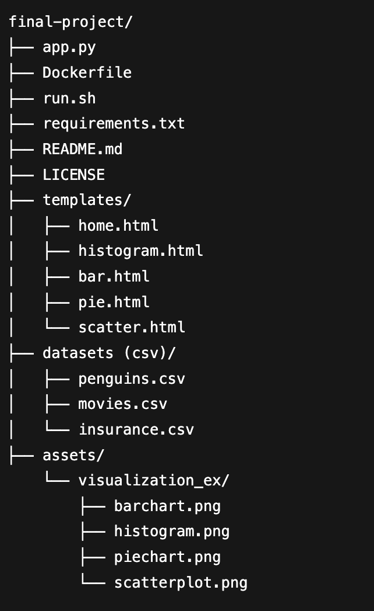

# CSV Visualizer
## A one-command, Dockerized Flask app for quick CSV visualization in your browser

This project is a fully containerized Flask web app that helps you explore CSV files visually without writing code. The user runs the app in using one command in the terminal, uploads a CSV in the browser, chooses their variable(s) of choice, and the app generates clean Matplotlib visualizations on demand. The app offers histograms and scatterplots for numeric data, as well as bar charts and pie charts for categorical data. It automatically detects column types, cleans the data, and produces polished plots.

## Architecture

Below is a diagram of the architecture of the system, followed by a breakdown of each component:



- **`final-project/`** — Root project directory for the Dockerized CSV visualization app.  
  - **`app.py`** — Flask app that handles CSV uploads, cleans data, and generates plots.  
  - **`Dockerfile`** — Plain text script that builds the container image with all dependencies and app code.  
  - **`run.sh`** — Builds and runs the Docker container.  
  - **`requirements.txt`** — Python package dependencies needed by the app.  
  - **`README.md`** — Project documentation and usage instructions.  
  - **`LICENSE`** — Licensing terms for using and sharing the code.  
  - **`.env.example`** — Template environment variable file for local/Docker config.  
  - **`.gitignore`** — Prevents unwanted files (e.g., venv, cache) from being committed.

  - **`templates/`** — HTML templates rendered by Flask for each page.  
    - **`templates/home.html`** — Upload page and main navigation for choosing plots.  
    - **`templates/histogram.html`** — Page that presents variable options and displays the generated histogram.  
    - **`templates/bar.html`** — Page that presents variable options and displays the generated bar chart.  
    - **`templates/pie.html`** — Page that presents variable options and displays the generated pie chart.  
    - **`templates/scatter.html`** — Page that presents variable options and displays the generated scatterplot.

  - **`datasets (csv)/`** — Sample CSV datasets included for testing/demo.  
    - **`datasets (csv)/penguins.csv`** — Example dataset for species/measurement exploration.  
    - **`datasets (csv)/movies.csv`** — Example dataset for movie attribute exploration.  
    - **`datasets (csv)/insurance.csv`** — Example dataset for insurance cost factor exploration.

  - **`assets/`** — Documentation images used in the README.  
    - **`assets/architecture.png`** — High-level architecture diagram of the system.  
    - **`assets/visualizations/`** — Example output images for each visualization type.  
    - **`assets/visualizations/barchart.png`** — Sample bar chart output screenshot.  
    - **`assets/visualizations/histogram.png`** — Sample histogram output screenshot.  
    - **`assets/visualizations/piechart.png`** — Sample pie chart output screenshot.  
    - **`assets/visualizations/scatterplot.png`** — Sample scatterplot output screenshot.  

## Installation & Running the App (Docker)

### Prerequisites
- **Docker** installed and running  
  - Mac/Windows: Docker Desktop  
  - Linux: Docker Engine

### Run Instructions

1) **Clone Repository**
```bash
git clone https://github.com/toby-draper/DS-2022-final-project
cd DS-2022-final-project
```

1) **Run App**
First time only (to allow the script to execute):
  ```bash
  chmod +x run.sh
  ```

Then run:
  ```bash
  ./run.sh
  ```
**What `run.sh` does:**
- Builds the Docker image: `final-project-app:latest`
- Runs the container on port **8000** (maps `8000` → `8000`)

3) **Explore Visualizations**
   - Using example or personal datasets, upload CSVs and generate plots in the browser.
  
4) **Terminate App**
   - When finished, stop the app with `Ctrl + C` in the terminal.

5) **Troubleshooting**
- **Port 8000 already in use:** run on a different host port (example 8001):
  ```bash
  docker run --rm -p 8001:8000 --env-file .env.example final-project-app:latest
  ```

  Then open: http://localhost:8001

- **Docker isn’t running:** start/restart Docker Desktop for Mac/Windows or the Docker service for Linux.  
- **Linux Docker permission denied:** if you see a “permission denied” error when Docker runs, try:
  ```bash
  sudo ./run.sh
  ```
## Example Outputs
Below are example outputs using the app's given datasets:

#### Histogram


#### Bar Chart


#### Pie Chart


#### Scatterplot


Each example contains consistent styling, correct scaling, proper axis labeling, and accurate representation of the underlying data.

## Known Issues
- **No metadata context:** CSVs rarely include units or definitions, so the app can’t confirm units and relies solely on column names for labeling.  
- **Incomplete data cleaning:** Data cleaning and validation are lightweight, so  some files with unique structures may likely fail to render correctly.

## Future Improvements
- **Data cleaning:** One major improvement would be to expand the data cleaning to ensure that almost any CSV file can be ingested without error.
- **User customization:** Another interesting improvement would be to add user controls for customizing plot styles, colors, font, and other parameters.

## Links
Github Repository: https://github.com/toby-draper/DS-2022-final-project